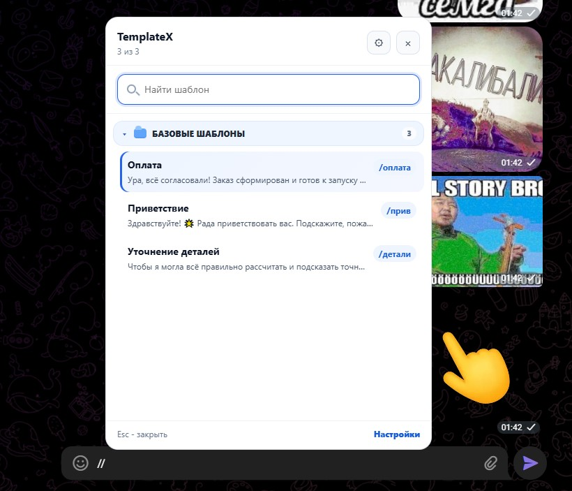
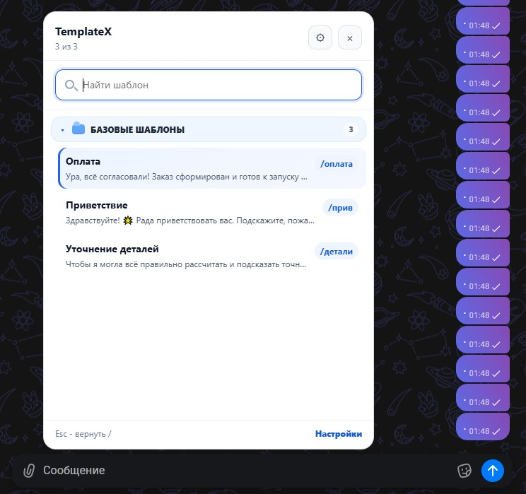
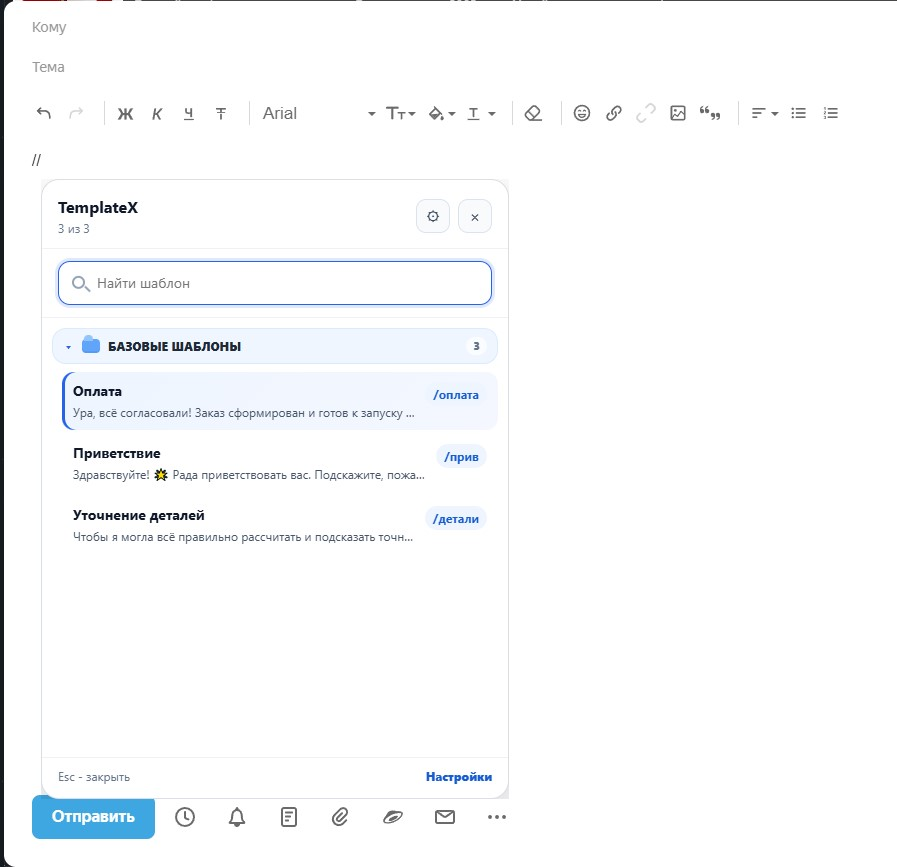
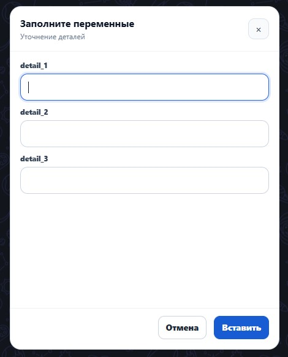

# TemplateX

**TemplateX** — браузерное расширение для быстрой вставки готовых сообщений, шаблонов и ответов в веб-мессенджеры и почту.

Проект сделан для менеджеров, поддержки, продаж, клиентских переписок и любых задач, где нужно быстро отправлять повторяющиеся сообщения без ручного копирования.

TemplateX работает прямо в браузере и помогает вставлять шаблоны в:

- Telegram Web
- Max Web
- Яндекс.Почту
- другие поля ввода на сайтах, где поддерживается обычный `contenteditable` / input

---

## Возможности

- Быстрая вставка шаблонов через команды.
- Поиск шаблонов через меню.
- Поддержка переменных внутри шаблонов.
- Окно заполнения переменных.
- Навигация по переменным стрелками вверх / вниз.
- Поддержка многострочных шаблонов.
- Импорт и экспорт шаблонов.
- Локальное хранение настроек в браузере.
- Отдельная логика для сложного редактора Max Web.
- Установка как обычное Chrome / Chromium расширение.

---

## Демонстрация

### Telegram Web



---

### Max Web



---

### Яндекс.Почта



---

### Окно переменных



Пример шаблона с переменными:

```text
Чтобы я могла всё правильно рассчитать и подсказать точную стоимость, уточните, пожалуйста:

1. {detail_1}
2. {detail_2}
3. {detail_3}
```

После выбора такого шаблона TemplateX откроет окно, где можно заполнить значения переменных.

---

## Установка

### Вариант 1. Скачать готовый релиз

1. Откройте страницу релизов:

```text
https://github.com/xerlovemate/TemplateX/releases
```

2. Скачайте архив последней версии:

```text
TemplateX-v1.0.0.zip
```

3. Распакуйте архив в любую удобную папку.

4. Откройте в браузере страницу расширений:

```text
chrome://extensions/
edge://extensions/
```

5. Включите **Режим разработчика**.

6. Нажмите **Загрузить распакованное расширение**.

7. Выберите распакованную папку TemplateX.

Готово. Расширение появится в браузере и будет готово к работе.

---

## Как пользоваться

### Telegram Web

В поле сообщения можно вводить быстрые команды:

```text
/прив
/детали
/оплата
```

Также можно открыть меню поиска шаблонов:

```text
//
```

После выбора шаблона текст автоматически вставится в поле сообщения.

---

### Max Web

Редактор Max Web устроен сложнее, чем обычные поля ввода, поэтому для него используется отдельный режим.

В Max нажмите:

```text
/
```

Откроется меню TemplateX. Начните вводить название шаблона:

```text
прив
детали
оплата
```

Выберите нужный шаблон — текст вставится в сообщение.

Важно: в Max не нужно писать `/прив` прямо в поле до конца. Достаточно нажать `/`, а дальше вводить название шаблона уже в меню TemplateX.

---

### Яндекс.Почта

В теле письма можно использовать команды:

```text
/прив
/детали
/оплата
```

---

## Шаблоны с переменными

TemplateX поддерживает переменные в шаблонах.

Пример:

```text
Здравствуйте! Подскажите, пожалуйста:

1. {detail_1}
2. {detail_2}
3. {detail_3}
```

При выборе шаблона появится окно заполнения переменных.

Управление в окне переменных:

- `ArrowDown` — перейти к следующему полю.
- `ArrowUp` — перейти к предыдущему полю.
- `Tab` — стандартное переключение фокуса.
- `Esc` — закрыть окно.
- `Вставить` — вставить готовый текст.

---

## Импорт и экспорт шаблонов

TemplateX хранит шаблоны локально в браузере.

В настройках расширения можно:

- добавить новый шаблон;
- изменить существующий шаблон;
- удалить шаблон;
- экспортировать шаблоны в файл;
- импортировать шаблоны из файла.

Это удобно, если нужно перенести настройки на другой компьютер или поделиться набором шаблонов с коллегами.

---

## FAQ

### Почему в Max Web не используются команды `/прив` прямо в поле?

Max Web использует сложный редактор на базе Lexical/Svelte. Он плохо переносит программную замену уже введённого текста. Поэтому TemplateX перехватывает `/` до попадания в поле и открывает собственное меню выбора шаблона. Это стабильнее и не ломает сообщение.

### Где хранятся шаблоны?

Шаблоны хранятся локально в браузере через storage расширения.

### Можно ли использовать TemplateX в других браузерах?

Расширение рассчитано на Chrome и Chromium-браузеры. Например, Google Chrome, Edge, Brave, Яндекс Браузер.

---

## Планы

- Синхронизация шаблонов между устройствами.
- Командная работа для нескольких менеджеров.
- Роли и общие наборы шаблонов.
- Backend для генерации платёжных ссылок.
- Интеграции с CRM и платёжными системами.

---

## Лицензия

MIT License.

---

## Автор

Проект: **TemplateX**

GitHub: [@xerlovemate](https://github.com/xerlovemate)
